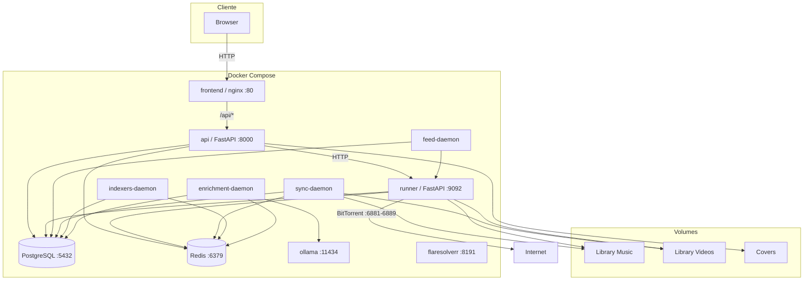
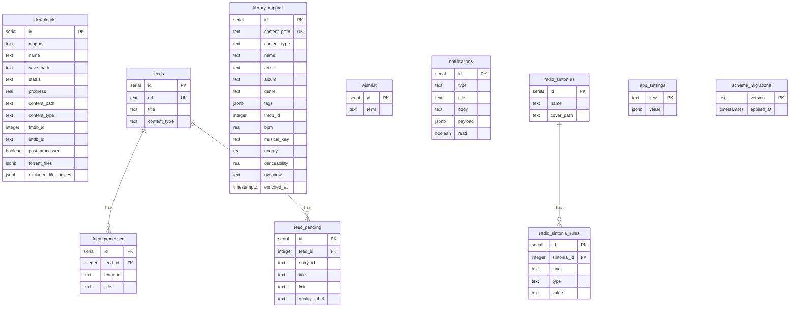
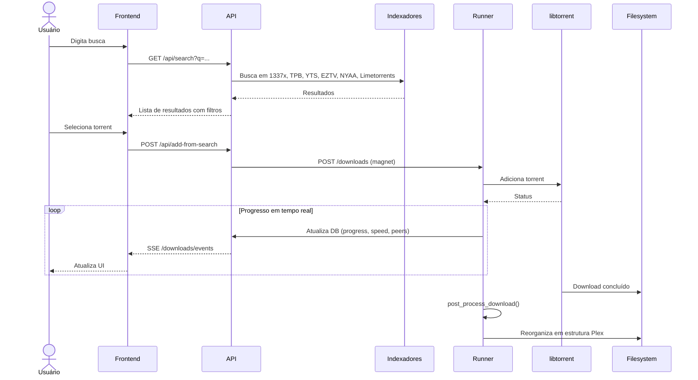
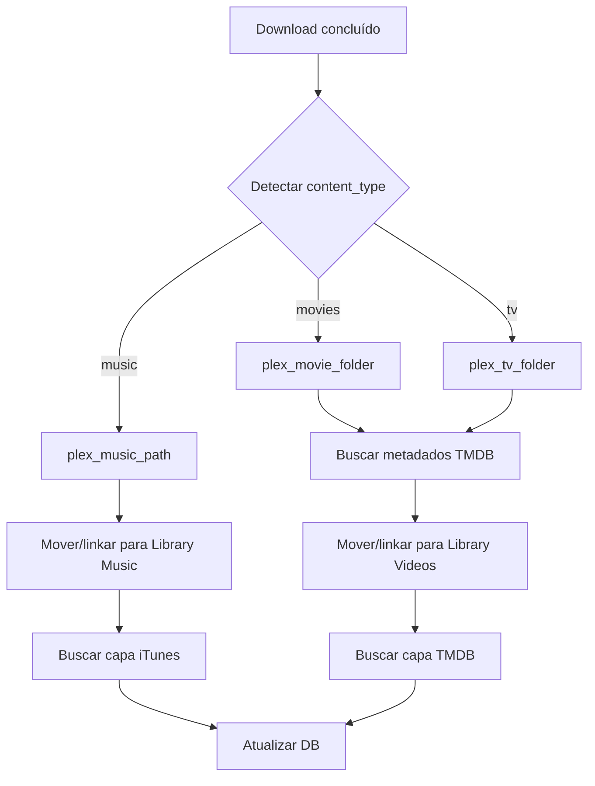
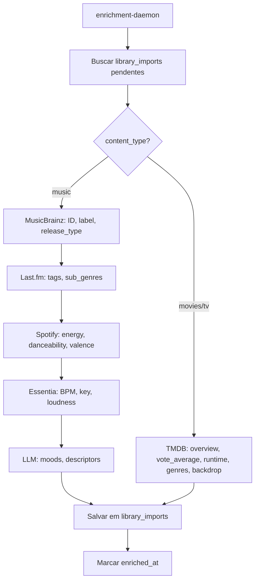
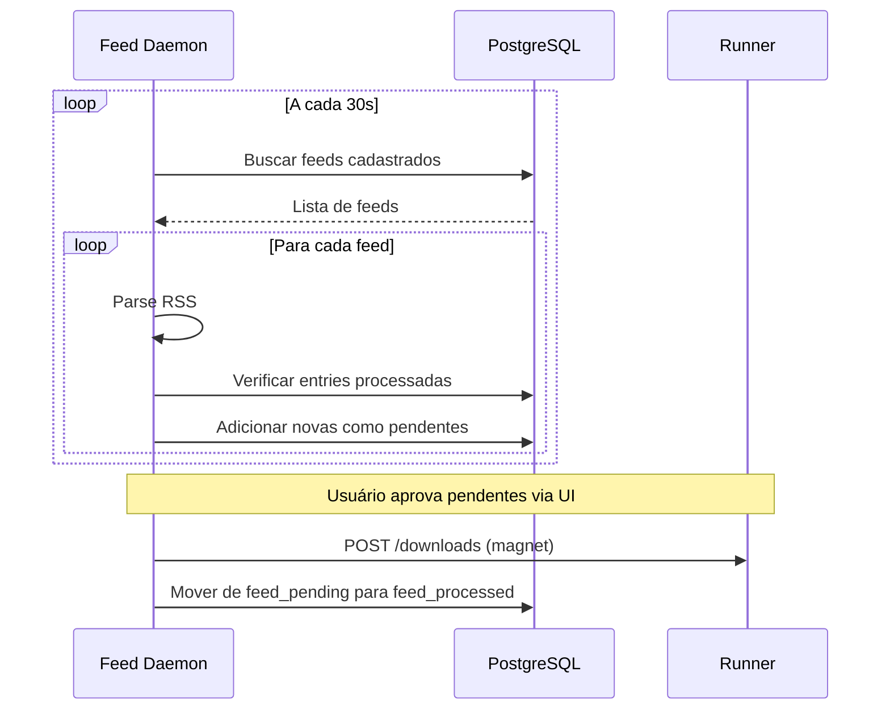
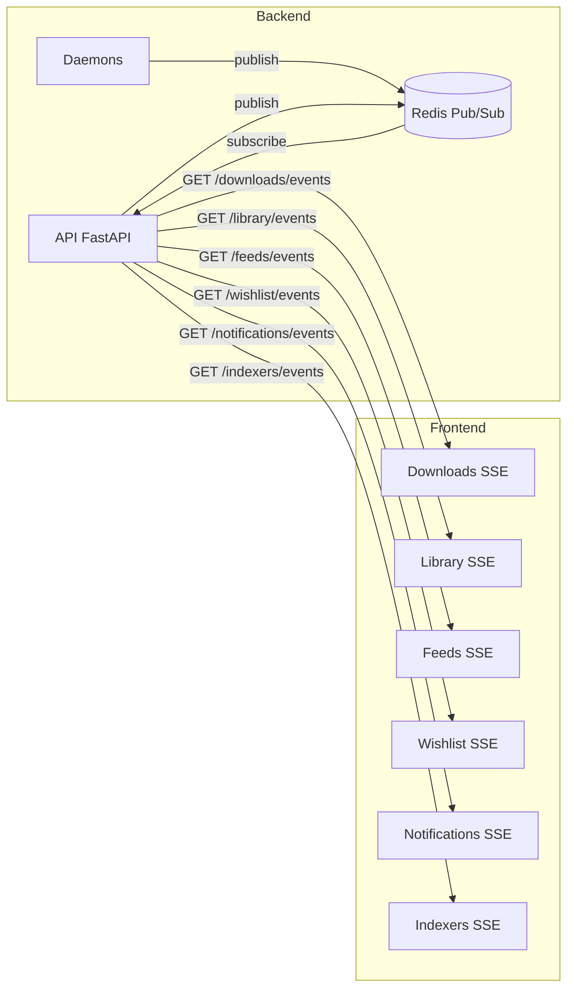

# Arquitetura do Projeto Atum (dl-torrent)

> **Versão:** 0.3.0  
> **Stack:** Python 3.10+ (FastAPI, Typer, libtorrent, psycopg3) · React 19 (Vite, TypeScript) · PostgreSQL 18 · Redis · Docker  
> **Licença:** Privada

---

## Sumário

1. [Visão Geral](#1-visão-geral)
2. [Classificação de Prioridade](#2-classificação-de-prioridade)
3. [Arquitetura Geral](#3-arquitetura-geral)
4. [Backend](#4-backend)
5. [Frontend](#5-frontend)
6. [Banco de Dados](#6-banco-de-dados)
7. [Infraestrutura e Deploy](#7-infraestrutura-e-deploy)
8. [Fluxos Principais](#8-fluxos-principais)
9. [Testes](#9-testes)
10. [Estrutura de Diretórios](#10-estrutura-de-diretórios)

---

## 1. Visão Geral

O **Atum** é uma aplicação completa de busca, download e gerenciamento de torrents com foco em mídia (música e vídeo). O sistema combina:

- **Busca multi-indexador** em 1337x, TPB, YTS, EZTV, NYAA e Limetorrents
- **Download via libtorrent** com progresso em tempo real (SSE)
- **Pós-processamento automático** com organização em estrutura Plex
- **Biblioteca de mídia** com scan de pastas existentes, capas e metadados
- **Player de áudio avançado** estilo receiver hi-fi com EQ paramétrico, análise espectral e Room EQ
- **Enriquecimento por IA** via MusicBrainz, Last.fm, Spotify, Essentia, TMDB e LLMs
- **Feeds RSS** e **Wishlist** para automação de downloads
- **Rádio** com sintonias baseadas em regras (gênero, artista, tags)

---

## 2. Classificação de Prioridade

Cada componente é classificado por importância para o funcionamento do sistema:

| Peso | Significado | Critério |
|------|-------------|----------|
| **A** | Crítico | Componente essencial — sem ele o sistema não funciona |
| **B** | Importante | Agrega valor significativo, mas o core funciona sem ele |
| **C** | Secundário | Feature complementar, melhoria de UX ou ferramenta auxiliar |

---

## 3. Arquitetura Geral



### Comunicação entre serviços

| De | Para | Protocolo | Propósito |
|----|------|-----------|-----------|
| nginx | api | HTTP (proxy reverso) | Encaminha `/api/*` para o backend |
| api | runner | HTTP REST | Delega operações de download |
| api | PostgreSQL | TCP (psycopg3 sync + async) | Persistência |
| api | Redis | TCP | Cache, pub/sub SSE |
| browser | api | SSE | Eventos em tempo real (downloads, library, feeds, etc.) |
| runner | Internet | BitTorrent (TCP/UDP 6881-6889) | Protocolo torrent |
| enrichment-daemon | ollama | HTTP | Inferência LLM |

---

## 4. Backend

### 4.1 Pontos de Entrada

| Componente | Arquivo | Peso | Descrição |
|------------|---------|------|-----------|
| CLI Typer | `src/app/main.py` | **B** | Ponto de entrada principal com subcomandos: `serve`, `runner`, `search`, `download`, `feed`, `sync`, `indexers`, `enrichment`, `wishlist`, `batch`, `library_reorganize` |
| API Web | `src/app/web/app.py` | **A** | FastAPI na porta 8000 — serve a API REST e o SPA (fallback para `frontend/dist`) |
| Download Runner | `src/app/runner/app.py` | **A** | FastAPI na porta 9092 — processo isolado para libtorrent, gerencia downloads e streaming de arquivos |

### 4.2 Routers da API

| Router | Prefixo | Peso | Endpoints principais |
|--------|---------|------|----------------------|
| search | `/api` | **A** | `GET /search`, `POST /search/resolve-magnet`, `GET /search-filter-suggestions`, `GET /tmdb-detail`, `POST /add-from-search` |
| downloads | `/api` | **A** | `GET /downloads`, `GET /downloads/events` (SSE), `POST /downloads`, `POST /downloads/{id}/start\|stop`, `DELETE /downloads/{id}`, `POST /torrent/metadata` |
| library | `/api/library` | **A** | `GET ""`, `GET /events` (SSE), `GET /{id}`, `GET /{id}/files`, `GET /{id}/stream`, `GET /imported/{id}`, `PATCH /imported/{id}`, `GET /facets`, `POST /imported/{id}/refresh-cover` |
| cover | `/api` | **B** | `GET /cover`, `GET /cover/file/{download_id}`, `GET /cover/file/import/{import_id}` |
| feeds | `/api/feeds` | **B** | `GET ""`, `GET /events` (SSE), `POST ""`, `DELETE /{id}`, `POST /poll`, `GET /pending`, `POST /pending/add-to-downloads` |
| wishlist | `/api/wishlist` | **B** | `GET ""`, `GET /events` (SSE), `POST ""`, `DELETE /{id}`, `POST /run` |
| notifications | `/api/notifications` | **B** | `GET ""`, `GET /events` (SSE), `GET /unread-count`, `PATCH /{id}/read`, `POST /mark-all-read`, `POST /clear` |
| radio | `/api/radio` | **B** | `GET /sintonias`, `POST /sintonias`, `PATCH /sintonias/{id}`, `DELETE /sintonias/{id}`, `POST /sintonias/{id}/queue`, `POST /sintonias/{id}/cover` |
| settings | `/api/settings` | **B** | `GET ""`, `PATCH ""`, `POST /test-connection`, `GET /enrichment-stats`, `POST /reorganize-library`, `GET /plex-sections` |
| indexers | `/api/indexers` | **C** | `GET /status`, `GET /events` (SSE) |

### 4.3 Lógica de Negócio

| Módulo | Arquivo | Peso | Descrição |
|--------|---------|------|-----------|
| Download Manager | `download_manager.py` | **A** | Core do sistema — `add()`, `list_downloads()`, `start()`, `stop()`, `delete()`, reconciliação com filesystem, restart de workers mortos |
| Download Worker | `download_worker.py` | **A** | Worker em thread para libtorrent/TorrentP — atualiza progresso no DB (~1s), dispara pós-processamento ao concluir |
| Search | `search.py` | **A** | `search_all()` busca em 6 indexadores simultaneamente (`ThreadPoolExecutor`), filtros de qualidade (áudio FLAC/ALAC/MP3, vídeo 4K/1080p/720p), resolução de magnets |
| Feeds | `feeds.py` | **B** | `add_feed()`, `poll_feeds()` com parse paralelo de feeds (`ThreadPoolExecutor`), seleção de pendentes, deduplicação por `entry_id` e `content_key` |
| Organize | `organize.py` | **B** | Estruturação em pastas Plex — `plex_movie_folder()`, `plex_tv_folder()`, `plex_music_path()`, detecção de `ContentType` (music/movies/tv) |
| Post-process | `post_process.py` | **B** | Pipeline pós-download — reorganiza em estrutura Plex, busca metadados TMDB, aplica naming correto |
| Sync Library | `sync_library_imports.py` | **B** | Scan de `LIBRARY_MUSIC_PATH` e `LIBRARY_VIDEOS_PATH`, importa pastas novas (sequencial) com enriquecimento paralelo (ffprobe + capas via `ThreadPoolExecutor`), remove itens cujo `content_path` não existe mais |
| Cover Service | `cover_service.py` | **B** | Busca capas via iTunes Search API e TMDB, cache local em disco |
| TMDB Enrichment | `tmdb_enrichment.py` | **B** | Busca de metadados de filmes/séries na API TMDB (título, ano, overview, backdrop, gêneros) |
| Settings Repository | `settings_repository.py` | **B** | Configurações em runtime na tabela `app_settings`, override do `.env` |
| AI Enrichment | `ai/enrichment_daemon.py` | **C** | Daemon que processa `library_imports` pendentes em batch paralelo (`ThreadPoolExecutor`, 3 workers), chama pipelines de música ou vídeo |
| Music Enrichment | `ai/enrich_music.py` | **C** | Pipeline com fases paralelas: MusicBrainz + Last.fm + Spotify + Essentia em `ThreadPoolExecutor(4)`, depois LLM — extrai BPM, key, energy, danceability, valence, sub_genres, moods, descriptors |
| Video Enrichment | `ai/enrich_video.py` | **C** | Enriquecimento via TMDB — tmdb_id, imdb_id, overview, vote_average, runtime, genres, backdrop |
| LLM Client | `ai/llm_client.py` | **C** | Cliente para Ollama e OpenRouter (API compatível com OpenAI), `chat()` e `chat_json()` com fallback de provider |
| Audio Metadata | `audio_metadata.py` | **C** | Leitura de tags de áudio via Mutagen (artista, álbum, gênero, ano) |
| Quality Compare | `quality_compare.py` | **C** | Comparação de qualidade entre versões (bitrate, codec, resolução) |
| File Linker | `file_linker.py` | **C** | Criação de hard/symlinks para economia de espaço em disco |

### 4.4 Camada de Dados

| Repositório | Arquivo | Peso | Entidade |
|-------------|---------|------|----------|
| DownloadRepository | `download_repository_postgres.py` | **A** | `downloads` |
| LibraryImportRepository | `library_import_repository_postgres.py` | **A** | `library_imports` |
| FeedRepository | `feed_repository_postgres.py` | **B** | `feeds`, `feed_processed`, `feed_pending` |
| WishlistRepository | `wishlist_repository_postgres.py` | **B** | `wishlist` |
| NotificationRepository | `notification_repository_postgres.py` | **B** | `notifications` |
| RadioRepository | `radio_repository_postgres.py` | **B** | `radio_sintonias`, `radio_sintonia_rules` |
| SettingsRepository | `settings_repository_postgres.py` | **B** | `app_settings` |

### 4.5 Configuração e Dependências

| Componente | Arquivo | Peso | Descrição |
|------------|---------|------|-----------|
| Config (Pydantic Settings) | `config.py` | **A** | Leitura de variáveis de ambiente: `DATABASE_URL`, `REDIS_URL`, `DOWNLOAD_RUNNER_URL`, `LIBRARY_MUSIC_PATH`, `LIBRARY_VIDEOS_PATH`, URLs dos indexadores, chaves de API (TMDB, Last.fm, Spotify) |
| DB Pool | `db_postgres.py` | **A** | Pool de conexões PostgreSQL via psycopg3: `ConnectionPool` (sync, 2–10 conexões) + `AsyncConnectionPool` (async, para FastAPI), aplicação automática de schema e migrations |
| Dependency Injection | `deps.py` | **A** | Factory de dependências: `get_settings()`, `get_repo()`, `get_cover_cache()`, `get_library_import_repo()`, `get_settings_repo()`, `get_llm_client()` |

### 4.6 Daemons em Background

| Daemon | Comando | Peso | Intervalo | Função |
|--------|---------|------|-----------|--------|
| Feed Daemon | `dl-torrent feed daemon` | **B** | 30s | Poll de feeds RSS e adição automática de downloads |
| Sync Daemon | `dl-torrent sync daemon` | **B** | 300s | Reconciliação de downloads com filesystem + scan de library imports |
| Indexers Daemon | `dl-torrent indexers daemon` | **C** | 300s | Health-check paralelo dos indexadores (`ThreadPoolExecutor`), atualiza Redis, notifica UI via SSE |
| Enrichment Daemon | `dl-torrent enrichment daemon` | **C** | 300s | Enriquecimento paralelo de `library_imports` em batch (`ThreadPoolExecutor`, 3 workers) |

### 4.7 Concorrência e Paralelismo

| Padrão | Onde | Propósito |
|--------|------|-----------|
| `ThreadPoolExecutor` | `search.py` `search_all()` | Busca em até 6 indexadores em paralelo |
| `ThreadPoolExecutor` | `ai/enrichment_daemon.py` | Processa até 3 itens do batch em paralelo |
| `ThreadPoolExecutor` | `ai/enrich_music.py` | MusicBrainz + Last.fm + Spotify + Essentia em 4 threads simultâneas |
| `ThreadPoolExecutor` | `indexer_status.py` `run_health_cycle()` | Probe de até 6 indexadores em paralelo |
| `ThreadPoolExecutor` | `sync_library_imports.py` | Enriquecimento de pastas novas (ffprobe + capas) em 4 threads |
| `ThreadPoolExecutor` | `feeds.py` `_collect_new_items()` | Parse de feeds RSS em paralelo (até 4 feeds simultâneos) |
| `ThreadPoolExecutor` | `settings.py` `reorganize_library()` | Post-processing de downloads/imports em 4 threads |
| `threading.Thread` | `download_manager.py` | 1 thread por download ativo, com `Lock` e `Event` |
| `threading.Thread` | `download_worker.py` | Threads separadas para busca de capa e pós-processamento |
| `asyncio.to_thread()` | Routers SSE e rotas async | Executa código síncrono sem bloquear o event loop |
| `httpx.AsyncClient` | Routers search, settings, downloads, library | HTTP assíncrono nativo no FastAPI |
| `psycopg3 AsyncConnectionPool` | `db_postgres.py` | Pool async de conexões PostgreSQL para rotas FastAPI |
| `psycopg3 ConnectionPool` | `db_postgres.py` | Pool sync thread-safe para daemons e CLI |

---

## 5. Frontend

### 5.1 Stack Tecnológico

| Tecnologia | Versão | Propósito |
|------------|--------|-----------|
| React | 19.2 | Framework UI |
| TypeScript | 5.9 | Tipagem estática |
| Vite | 7.3 | Bundler e dev server |
| React Router DOM | 7.13 | Roteamento SPA |
| Wavesurfer.js | 7.12 | Waveform de áudio |
| react-icons (Io5) | 5.6 | Ícones |

**Estilização:** CSS puro com variáveis customizadas (tema escuro "Atum", acento verde `#1db954`).  
**Fontes:** Barlow, Inter, Orbitron (Google Fonts).

### 5.2 Roteamento

| Rota | Componente | Peso | Descrição |
|------|------------|------|-----------|
| `/` | `Home` | **B** | Dashboard com saudação, atalhos e prévia da biblioteca |
| `/search` | `Search` | **A** | Busca de torrents com filtros, paginação e modais de adição |
| `/detail` | `Detail` | **B** | Detalhes de filme/série via TMDB |
| `/downloads` | `Downloads` | **A** | Fila de downloads com status em tempo real, ações de controle |
| `/library` | `Library` | **A** | Biblioteca de música/vídeos com facets (artista, álbum, gênero), edição de metadados |
| `/feeds` | `Feeds` | **B** | Gerenciamento de feeds RSS e itens pendentes |
| `/wishlist` | `Wishlist` | **B** | Termos salvos para busca automática |
| `/radio` | `Radio` | **B** | Sintonias com regras de include/exclude |
| `/settings` | `Settings` | **B** | Configurações da aplicação (pastas, integrações, AI provider) |
| `/play/:id` | `Player` | **A** | Player de vídeo/áudio simples |
| `/play-receiver/:id` | `ReceiverPlayer` | **C** | Player de áudio avançado estilo receiver hi-fi |

### 5.3 Componentes

#### Componentes de Layout e UI

| Componente | Arquivo | Peso | Descrição |
|------------|---------|------|-----------|
| Layout | `components/Layout.tsx` | **A** | Sidebar de navegação, menu mobile, notificações via SSE |
| MediaCard | `components/MediaCard.tsx` | **A** | Card reutilizável com capa, metadados, overlay e ações |
| CoverImage | `components/CoverImage.tsx` | **B** | Exibição de capas via `/api/cover` |
| EmptyState | `components/EmptyState.tsx` | **B** | Estado vazio com título, descrição e ação |
| ToastList | `components/ToastList.tsx` | **B** | Lista de notificações toast com auto-dismiss |

#### Componentes de Busca

| Componente | Arquivo | Peso | Descrição |
|------------|---------|------|-----------|
| SearchFilesModal | `components/search/SearchFilesModal.tsx` | **B** | Modal com lista de arquivos do torrent |
| SearchAddModal | `components/search/SearchAddModal.tsx` | **B** | Modal para seleção de arquivos e adição à fila |

#### Componentes do Receiver (Áudio Avançado)

| Componente | Arquivo | Peso | Descrição |
|------------|---------|------|-----------|
| ReceiverPanel | `components/receiver/ReceiverPanel.tsx` | **C** | Painel principal: transport, meters, spectrum, EQ, controles, SmartEQ |
| VuMeter | `components/receiver/VuMeter.tsx` | **C** | Medidor VU L/R estilo display VFD |
| PowerMeter | `components/receiver/PowerMeter.tsx` | **C** | Medidor de pico dBFS com peak hold |
| ParametricEQ | `components/receiver/ParametricEQ.tsx` | **C** | Equalizador paramétrico 10 bandas (40Hz–20kHz) |
| SmartEQ | `components/receiver/SmartEQ.tsx` | **C** | Análise espectral automática, target curves (Harman, B&K), Room EQ via microfone |
| ReceiverSlider | `components/receiver/ReceiverSlider.tsx` | **C** | Slider com label e valor formatado |
| ReceiverToggle | `components/receiver/ReceiverToggle.tsx` | **C** | Toggle para LOUDNESS, ATT, SMART EQ |

### 5.4 Módulos de Áudio

| Módulo | Arquivo | Peso | Descrição |
|--------|---------|------|-----------|
| Audio Engine | `audio/audioEngine.ts` | **C** | Grafo Web Audio: Source → ATT → Volume → EQ (10 bandas) → Loudness → Balance → Analysers. Controla volume, balance, atenuação, bypass de EQ |
| Analysis | `audio/analysis.ts` | **C** | Cálculo de RMS, pico dBFS, FFT, normalização VU/dBFS, loudness boost, inferência de qualidade |
| Spectral EQ | `audio/spectralEQ.ts` | **C** | `SpectralAnalyzer` com target curves (Harman, B&K, etc.), análise de referência, cálculo de correção |
| Room EQ | `audio/roomEQ.ts` | **C** | `RoomEQSession`: geração de pink noise, captura via microfone, medição e correção acústica da sala |

### 5.5 Contextos (Estado Global)

| Contexto | Arquivo | Peso | Descrição |
|----------|---------|------|-----------|
| DownloadsEventsContext | `contexts/DownloadsEventsContext.tsx` | **A** | Lista de downloads via SSE (`/api/downloads/events`), `refetch()`, estado `reconnecting` |
| ToastContext | `contexts/ToastContext.tsx` | **B** | `showToast()` com auto-dismiss, renderiza `ToastList` |

### 5.6 Utilitários

| Módulo | Arquivo | Peso | Descrição |
|--------|---------|------|-----------|
| Format | `utils/format.ts` | **B** | `formatFileSize(bytes)` (B→TB), `statusLabel(status)` (labels de status de download) |

### 5.7 Comunicação com Backend

- **API REST:** fetch para `/api/*` (proxy via Vite em dev, nginx em produção)
- **SSE (Server-Sent Events):** downloads, library, feeds, wishlist, indexers, notifications — 6 canais de eventos em tempo real
- **Persistência local:** `localStorage` para configurações do DSP do receiver e reference tracks do SmartEQ

---

## 6. Banco de Dados

### 6.1 Diagrama ER



### 6.2 Tabelas

| Tabela | Peso | Descrição |
|--------|------|-----------|
| `downloads` | **A** | Fila de downloads — magnet, status, progresso, seeds/peers, velocidade, bytes, content_path, content_type, metadados TMDB |
| `library_imports` | **A** | Itens da biblioteca descobertos pelo sync — path, tipo, metadados, capas, dados de enriquecimento (BPM, key, energy, moods, etc.) |
| `feeds` | **B** | Feeds RSS cadastrados com URL e content_type |
| `feed_processed` | **B** | Entradas de feed já processadas (deduplicação) |
| `feed_pending` | **B** | Entradas de feed aguardando aprovação do usuário |
| `wishlist` | **B** | Termos de busca salvos para automação |
| `notifications` | **B** | Notificações da UI (tipo, título, corpo, payload, leitura) |
| `radio_sintonias` | **B** | Presets de rádio com nome e capa |
| `radio_sintonia_rules` | **B** | Regras de include/exclude por content_type, genre, artist, tag ou item |
| `app_settings` | **B** | Configurações em runtime (key/value JSONB), overrides do `.env` |
| `schema_migrations` | **A** | Controle de versionamento do schema (migrations aplicadas) |

### 6.3 Migrations

| Arquivo | Conteúdo |
|---------|----------|
| `001_radio_sintonias.sql` | Tabelas `radio_sintonias` e `radio_sintonia_rules` |
| `002_radio_sintonia_cover.sql` | Coluna `cover_path` em `radio_sintonias` |
| `003_app_settings_and_enrichment.sql` | Tabela `app_settings`; colunas TMDB/IMDB em `downloads` e `library_imports`; colunas de pós-processamento |
| `004_enrichment_agent.sql` | Colunas de enriquecimento em `library_imports` (BPM, key, energy, danceability, moods, descriptors, etc.); índice parcial para pendentes |

Migrations são aplicadas automaticamente na primeira conexão ao banco (`db_postgres.py` → `_run_pending_migrations()`). Apenas migrations não registradas em `schema_migrations` são executadas.

---

## 7. Infraestrutura e Deploy

### 7.1 Serviços Docker

| Serviço | Imagem | Portas | Peso | Descrição |
|---------|--------|--------|------|-----------|
| **frontend** | `atum-frontend:v0.2.0` | 80 | **A** | Nginx servindo SPA + proxy reverso para `/api` |
| **api** | `atum-api:v0.2.0` | 8000 (interno) | **A** | FastAPI Web API |
| **runner** | `atum-runner:v0.2.0` | 9092 (interno), 6881–6889 (BitTorrent) | **A** | Download Runner (libtorrent) |
| **postgres** | `postgres:18-alpine` | 5432 | **A** | Banco de dados PostgreSQL |
| **redis** | `redis:latest` | 6379 | **A** | Cache e pub/sub para eventos SSE |
| **feed-daemon** | `atum-api:v0.2.0` | — | **B** | Poll de feeds RSS a cada 30s |
| **sync-daemon** | `atum-api:v0.2.0` | — | **B** | Scan da biblioteca + reconciliação a cada 300s |
| **indexers-daemon** | `atum-api:v0.2.0` | — | **C** | Health-check dos indexadores a cada 300s |
| **enrichment-daemon** | `atum-enrichment:v0.2.0` | — | **C** | Enriquecimento de metadados em batch |
| **ollama** | `ollama/ollama` | 11434 | **C** | LLM local (profile `ai`, opt-in) |
| **flaresolverr** | `flaresolverr/flaresolverr` | 8191 | **C** | Bypass Cloudflare para scraping |

### 7.2 Dockerfiles

| Arquivo | Base | Peso | Descrição |
|---------|------|------|-----------|
| `Dockerfile` | `python:3.12-slim` | **A** | API e Runner — instala gcc, libpq-dev, ffmpeg |
| `Dockerfile.frontend` | `node:20-alpine` → `nginx:alpine` | **A** | Multi-stage: build do frontend + entrega via nginx |
| `Dockerfile.enrichment` | `python:3.12-slim` | **C** | Daemon de enriquecimento — dependências extras: essentia, libav*, libchromaprint |

### 7.3 Volumes

| Volume | Propósito |
|--------|-----------|
| `postgres_data` | Dados persistentes do PostgreSQL |
| `redis_data` | Dados persistentes do Redis |
| `api_covers` | Cache de capas de mídia |
| `ollama_models` | Modelos LLM do Ollama |
| Host: `Library/Music` | Biblioteca de música (bind mount) |
| Host: `Library/Videos` | Biblioteca de vídeos (bind mount) |

### 7.4 Rede

Todos os serviços compartilham a rede bridge `dl-torrent`. O nginx encaminha requisições `/api/*` para o serviço `api:8000` com timeouts de 60s.

### 7.5 CI/CD

GitHub Actions (`.github/workflows/build-and-push-ghcr.yml`) faz build e push das imagens `atum-api`, `atum-runner` e `atum-frontend` para o GitHub Container Registry.

### 7.6 Configuração Nginx (Produção)

```
location /       → SPA (try_files → index.html)
location /api/   → proxy_pass http://api:8000
```

Headers de proxy: Host, X-Real-IP, X-Forwarded-For, X-Forwarded-Proto.

### 7.7 Proxy Vite (Desenvolvimento)

```
/api → http://localhost:8000 (changeOrigin: true)
```

---

## 8. Fluxos Principais

### 8.1 Busca e Download



### 8.2 Pós-processamento e Organização



### 8.3 Enriquecimento por IA



### 8.4 Feeds RSS



### 8.5 Eventos em Tempo Real (SSE)



---

## 9. Testes

### 9.1 Estrutura

| Tipo | Diretório | Peso | Descrição |
|------|-----------|------|-----------|
| Unitários | `tests/unit/` | **A** | Testes de lógica isolada: download_manager, config, enrichment, feeds_filter, etc. |
| Integração | `tests/integration/` | **B** | Testes com PostgreSQL real: repositórios, search |
| E2E | `tests/e2e/` | **B** | Testes via Typer CliRunner: fluxos CLI completos |

### 9.2 Configuração

- Framework: **pytest** com `pytest-cov`
- `testpaths = ["tests"]`, `pythonpath = ["src"]`
- Marcador `requires_db` para testes que dependem de PostgreSQL
- Fixture `requires_database_url` (session): pula testes se `DATABASE_URL` não estiver definido

### 9.3 Execução

```bash
pip install -e ".[dev]"
pytest tests
pytest tests --cov=app --cov-report=term-missing
```

---

## 10. Estrutura de Diretórios

```
dl-torrent/
├── src/app/                          # Backend Python
│   ├── main.py                       # [B] CLI Typer (entry point)
│   ├── config.py                     # [A] Pydantic Settings
│   ├── deps.py                       # [A] Dependency injection
│   ├── db_postgres.py                # [A] Pool de conexões e migrations
│   ├── download_manager.py           # [A] Gerenciamento de downloads
│   ├── download_worker.py            # [A] Worker libtorrent
│   ├── search.py                     # [A] Busca multi-indexador
│   ├── feeds.py                      # [B] Feeds RSS
│   ├── organize.py                   # [B] Organização Plex
│   ├── post_process.py               # [B] Pós-processamento
│   ├── sync_library_imports.py       # [B] Scan de biblioteca
│   ├── audio_metadata.py             # [C] Tags de áudio
│   ├── quality_compare.py            # [C] Comparação de qualidade
│   ├── file_linker.py                # [C] Hard/symlinks
│   ├── tmdb_enrichment.py            # [B] Metadados TMDB
│   ├── ai/                           # [C] Enriquecimento por IA
│   │   ├── enrichment_daemon.py
│   │   ├── enrich_music.py
│   │   ├── enrich_video.py
│   │   └── llm_client.py
│   ├── client/                       # [A] Clientes torrent
│   ├── domain/                       # [A] Portas e modelos
│   ├── repositories/                 # [A] Acesso a dados PostgreSQL
│   ├── runner/                       # [A] Download Runner
│   │   └── app.py
│   └── web/                          # [A] API Web
│       ├── app.py
│       ├── cover_service.py
│       └── routers/
│           ├── downloads.py
│           ├── search.py
│           ├── library.py
│           ├── feeds.py
│           ├── wishlist.py
│           ├── notifications.py
│           ├── radio.py
│           ├── settings.py
│           └── indexers.py (via __init__.py)
├── frontend/                         # Frontend React
│   ├── src/
│   │   ├── App.tsx                   # [A] Roteamento
│   │   ├── main.tsx                  # [A] Entry point
│   │   ├── index.css                 # [A] Tema e variáveis CSS
│   │   ├── audio/                    # [C] Engine de áudio avançado
│   │   │   ├── audioEngine.ts
│   │   │   ├── analysis.ts
│   │   │   ├── spectralEQ.ts
│   │   │   └── roomEQ.ts
│   │   ├── components/
│   │   │   ├── Layout.tsx            # [A] Layout principal
│   │   │   ├── MediaCard.tsx         # [A] Card de mídia
│   │   │   ├── CoverImage.tsx        # [B] Imagem de capa
│   │   │   ├── EmptyState.tsx        # [B] Estado vazio
│   │   │   ├── ToastList.tsx         # [B] Toasts
│   │   │   ├── receiver/            # [C] Componentes do receiver
│   │   │   └── search/              # [B] Modais de busca
│   │   ├── contexts/
│   │   │   ├── DownloadsEventsContext.tsx  # [A] SSE downloads
│   │   │   └── ToastContext.tsx           # [B] Toasts
│   │   ├── pages/                    # Páginas da aplicação
│   │   ├── styles/                   # CSS do receiver e SmartEQ
│   │   └── utils/                    # Formatação
│   ├── package.json
│   └── vite.config.ts
├── scripts/
│   ├── schema_postgres.sql           # [A] Schema base do banco
│   ├── migrations/                   # [A] Migrations versionadas
│   ├── serve.ps1                     # [B] Script de dev local
│   ├── scraping/                     # [C] Scrapers por indexador
│   └── investigate_corruption.py     # [C] Debug de áudio
├── tests/
│   ├── unit/                         # [A] Testes unitários
│   ├── integration/                  # [B] Testes de integração
│   └── e2e/                          # [B] Testes E2E
├── docker/
│   └── nginx.conf                    # [A] Config do nginx
├── Dockerfile                        # [A] Backend
├── Dockerfile.frontend               # [A] Frontend
├── Dockerfile.enrichment             # [C] Enrichment daemon
├── docker-compose.yml                # [A] Orquestração
├── pyproject.toml                    # [A] Metadados e dependências Python
├── requirements.txt                  # [A] Dependências pinadas
├── .env.example                      # [B] Exemplo local
├── .env.docker.example               # [B] Exemplo Docker
└── README.md                         # [B] Documentação
```
