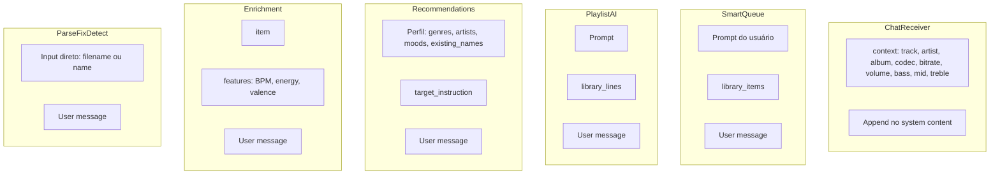

# Análise de Prompts: Geral e Específicos por Operação

## 1. Visão Geral

O sistema usa dois tipos de interação com o LLM:

| Tipo | Método | Retorno | Uso |
|------|--------|---------|-----|
| **Conversacional** | `chat()` / `chat_stream()` | Texto livre | chat_receiver |
| **Estruturado** | `chat_json()` | JSON parseado | smart_queue, playlist_ai, recommendations, enrichment, parse_torrent, fix_metadata, detect_content_type |

---

## 2. Template Geral para Prompts Estruturados

Para padronizar prompts que retornam JSON:

```
[ROLE E CONTEXTO]
Você é [persona]. [Objetivo da tarefa].

[REGRAS E CRITÉRIOS]
- Regra 1
- Regra 2
...

[FORMATO DE SAÍDA]
Retorne SOMENTE JSON puro (sem markdown, sem ```):
{
  "campo1": tipo,
  "campo2": tipo,
  ...
}
```

---

## 3. Prompts por Operação

### 3.1 chat_receiver (Conversacional)

**Tipo:** Texto livre (pode conter `$$ACTION:...` no final)

**Contexto injetado (user message ou append no system):**

| Parâmetro | Tipo | Descrição |
|-----------|------|-----------|
| `track` | string | Nome da faixa atual |
| `artist` | string | Artista |
| `album` | string | Álbum |
| `codec` | string | FLAC, MP3, AAC, etc. |
| `bitrate` | string | Ex: "320 kbps" |
| `volume` | int | 0-100 |
| `bass` | int | -6 a +6 dB |
| `mid` | int | -6 a +6 dB |
| `treble` | int | -6 a +6 dB |

**Formato de retorno:** Texto livre. Se houver ação, termina com:
```
$$ACTION:{"action":"<tipo>", ...params}
```

**Tipos de ação:**
- `play`, `pause`, `stop`, `next`, `prev`
- `volume`: `{"action":"volume","value":0-100}`
- `eq`: `{"action":"eq","bass":-6..6,"mid":-6..6,"treble":-6..6}`
- `navigate`: `{"action":"navigate","path":"/library|/search|/settings|/feeds|/playlists"}`
- `create_collection`: `{"action":"create_collection","name":"...","kind":"static|dynamic_rules|dynamic_ai","rules":[...],"ai_prompt":"...","description":"..."}`

---

### 3.2 smart_queue (Estruturado)

**Contexto injetado (user message):**

| Parâmetro | Tipo | Descrição |
|-----------|------|-----------|
| `prompt` | string | Pedido do usuário (ex: "rock energético para treino") |
| `library_items` | array | `[{id, name, artist?, genre?, moods?, sub_genres?, bpm?}]` |

**Formato JSON padronizado:**

```json
{
  "ids": [1, 2, 3],
  "explanation": "string"
}
```

| Campo | Tipo | Obrigatório | Descrição |
|-------|------|-------------|-----------|
| `ids` | int[] | sim | IDs de itens da biblioteca |
| `explanation` | string | sim | Razão breve em português |

---

### 3.3 playlist_ai (Estruturado)

**Contexto injetado (user message):**

| Parâmetro | Tipo | Descrição |
|-----------|------|-----------|
| `prompt` | string | Pedido do usuário |
| `library_lines` | array | Linhas no formato `"ID=N: {name} by {artist} [genre]"` |

**Formato JSON padronizado:**

```json
{
  "ids": [1, 2, 3],
  "explanation": "string"
}
```

| Campo | Tipo | Obrigatório | Descrição |
|-------|------|-------------|-----------|
| `ids` | int[] | sim | IDs de itens da biblioteca |
| `explanation` | string | sim | Resumo detalhado do racional em português |

---

### 3.4 recommendations (Estruturado)

**Contexto injetado (user message):**

| Parâmetro | Tipo | Descrição |
|-----------|------|-----------|
| `library_size` | int | Total de itens |
| `top_genres` | string[] | Gêneros mais frequentes |
| `top_artists` | string[] | Artistas mais frequentes |
| `top_moods` | string[] | Moods mais frequentes |
| `top_sub_genres` | string[] | Sub-gêneros |
| `content_types` | string[] | music, movies, tv |
| `existing_names` | string[] | Amostra de itens já na biblioteca |
| `target_instruction` | string | "wishlist" | "feeds" | "both" |

**Formato JSON padronizado:**

```json
{
  "wishlist": [
    {
      "term": "string",
      "reason": "string",
      "content_type": "music|movies|tv"
    }
  ],
  "feeds": [
    {
      "url": "string",
      "title": "string",
      "reason": "string",
      "content_type": "music|movies|tv"
    }
  ]
}
```

| Campo | Tipo | Obrigatório | Descrição |
|-------|------|-------------|-----------|
| `wishlist` | object[] | sim | `term`: "Artista - Álbum" ou "Nome (Ano)" |
| `wishlist[].term` | string | sim | Termo buscável |
| `wishlist[].reason` | string | sim | Razão curta |
| `wishlist[].content_type` | string | sim | music \| movies \| tv |
| `feeds` | object[] | sim | URLs de feed RSS |
| `feeds[].url` | string | sim | URL real |
| `feeds[].title` | string | sim | Nome do feed |
| `feeds[].reason` | string | sim | Razão curta |
| `feeds[].content_type` | string | sim | music \| movies \| tv |

---

### 3.5 enrichment (Estruturado)

**Contexto injetado (user message):**

| Parâmetro | Tipo | Descrição |
|-----------|------|-----------|
| `artist` | string | Artista |
| `album` | string | Álbum |
| `genre` | string | Gênero principal |
| `sub_genres` | string[] | Sub-gêneros conhecidos |
| `descriptors` | string[] | Tags externas |
| `bpm` | float | BPM |
| `musical_key` | string | Tom |
| `energy` | float | Energia (0-1) |
| `valence` | float | Valência (0-1) |

**Formato JSON padronizado:**

```json
{
  "moods": ["string"],
  "descriptors": ["string"],
  "sub_genres": ["string"]
}
```

| Campo | Tipo | Obrigatório | Descrição |
|-------|------|-------------|-----------|
| `moods` | string[] | sim | 3-5 emoções/atmosferas em português |
| `descriptors` | string[] | sim | 2-4 contextos de uso em português |
| `sub_genres` | string[] | sim | 2-5 sub-gêneros em inglês lowercase |

---

### 3.6 parse_torrent (Estruturado)

**Contexto injetado (user message):**

| Parâmetro | Tipo | Descrição |
|-----------|------|-----------|
| `torrent_name` | string | Nome do torrent (input direto) |

**Formato JSON padronizado:**

```json
{
  "content_type": "music|movies|tv",
  "artist": "string",
  "album": "string",
  "title": "string",
  "year": 2020,
  "show": "string",
  "season": 1,
  "episode": 1,
  "genre": "string"
}
```

| Campo | Tipo | Obrigatório | Descrição |
|-------|------|-------------|-----------|
| `content_type` | string | sim | music \| movies \| tv |
| `artist` | string | não | music only |
| `album` | string | não | music only |
| `title` | string | não | movie/show title |
| `year` | int | não | 4 dígitos |
| `show` | string | não | tv only |
| `season` | int | não | tv only |
| `episode` | int | não | tv only |
| `genre` | string | não | se óbvio |

**Regra:** Omitir campos não determináveis. Nomes limpos sem tags de qualidade.

---

### 3.7 fix_metadata (Estruturado)

**Contexto injetado (user message):**

| Parâmetro | Tipo | Descrição |
|-----------|------|-----------|
| `filename` | string | Nome do arquivo |
| `folder_path` | string | Caminho da pasta |
| `existing` | object | `{artist?, album?, title?, year?, genre?}` |

**Formato JSON padronizado:**

```json
{
  "artist": "string",
  "album": "string",
  "title": "string",
  "year": 2020,
  "genre": "string"
}
```

| Campo | Tipo | Obrigatório | Descrição |
|-------|------|-------------|-----------|
| `artist` | string | não | Preencher apenas se faltar |
| `album` | string | não | Idem |
| `title` | string | não | Faixa, sem número |
| `year` | int | não | 4 dígitos |
| `genre` | string | não | Se conhecido |

**Regra:** Incluir apenas campos com alta confiança. Não inventar.

---

### 3.8 detect_content_type (Estruturado)

**Contexto injetado (user message):**

| Parâmetro | Tipo | Descrição |
|-----------|------|-----------|
| `name` | string | Nome do torrent/arquivo |

**Formato JSON padronizado:**

```json
{
  "content_type": "music|movies|tv",
  "confidence": 0.95
}
```

| Campo | Tipo | Obrigatório | Descrição |
|-------|------|-------------|-----------|
| `content_type` | string | sim | music \| movies \| tv |
| `confidence` | float | sim | 0.0 a 1.0 |

---

## 4. Padronização de Resposta JSON

### 4.1 Schema Comum

Para respostas estruturadas, adotar:

1. **Envelope opcional (futuro):**
   ```json
   {
     "ok": true,
     "data": { ... },
     "explanation": "string"
   }
   ```

2. **Formato atual:** Objeto direto com campos específicos conforme o prompt.

3. **Regras gerais:**
   - Sem markdown (```json)
   - Sem texto antes/depois do JSON
   - Campos omitidos quando não aplicável
   - Arrays vazios `[]` quando não houver itens

### 4.2 Tratamento de Erro no Parse

O `chat_json()` em `llm_client.py`:
- Extrai `{...}` do texto (find/rfind)
- Retorna `{}` se não conseguir parsear
- Loga warning com o conteúdo retornado

---

## 5. Injeção de Contexto por Operação



---

## 6. Recomendações de Implementação

1. **Adicionar schemas JSON ao registry:** `prompts_registry.py` pode incluir `expected_schema` por prompt para validação e documentação.

2. **Dry-run com schema:** O dry-run pode retornar `expected_schema` junto com o resultado para facilitar o debug.

3. **Validação pós-parse:** Após `chat_json()`, validar contra o schema esperado e logar warnings para campos faltantes ou tipos incorretos.

4. **Prompt unificado para smart_queue e playlist_ai:** Ambos retornam `{ids, explanation}`. Podem compartilhar um único prompt base com variações de contexto.
