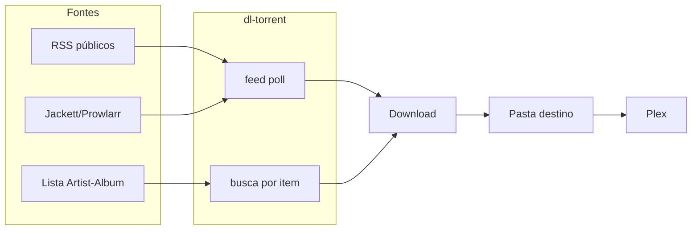

# Arquitetura "Netflix self-hosted" (música)

Visão do fluxo alvo para automatizar descoberta, download e organização de música e ouvi-la em casa como um "Netflix self-hosted", com o dl-torrent no centro do pipeline.

---

## Visão em uma frase

Automatizar **descoberta** (RSS e listas de playlists/tendências) + **filtros** + **download** + **organização em pastas** + **biblioteca no Plex**, para ouvir música em alta qualidade sem depender só de streaming.

---

## Diagrama de fluxo

- **Fontes:** RSS públicos + Jackett/Prowlarr quando o site não tem RSS; ou uma **lista** de itens (Artist - Album / Artist - Track) vinda de Spotify, Last.fm ou "Radar de Trend".
- **dl-torrent:** Para RSS: `feed poll` com filtros por qualidade (e no futuro --include/--exclude). Para lista: buscar cada item com preferência de qualidade e enviar para download.
- **Download:** Transmission, uTorrent ou download direto (conforme configuração).
- **Pasta:** Hoje fixa; alvo: pasta por artista/álbum (ex.: `DOWNLOAD_DIR/Artist/Album/`).
- **Plex:** Biblioteca "Música" apontando para a mesma pasta; scan automático quando novos arquivos aparecem.

---

## Papel de cada peça

- **dl-torrent:** Inscrever em feeds RSS, fazer poll periódico, filtrar por qualidade e por palavras-chave (`--include`, `--exclude`); ou receber uma lista via comando `batch` (arquivo ou stdin) e, para cada linha, fazer busca e baixar o melhor resultado. Com `--organize`, cria subpastas `Artist/Album/` no download direto. Opção `feed daemon` para poll em loop; notificação (webhook/desktop) ao detectar novo item.
- **Agendador (cron / Task Scheduler) ou feed daemon:** Rodar `dl-torrent feed poll --auto-download` a cada X minutos, ou `dl-torrent feed daemon --interval 30`. Para listas (Spotify, Last.fm), use `dl-torrent batch lista.txt`.
- **Plex:** Apontar a biblioteca "Música" para a pasta de download (ex.: `DOWNLOAD_DIR` ou `D:\Musica`). Não precisa de integração direta com dl-torrent; basta a pasta estar organizada (e, se possível, Artist/Album para melhor metadado).

---

## O que o dl-torrent já cobre

- Feed add/list/poll, filtro por formato (`--format`), **`--include`** e **`--exclude`** (palavras-chave no título), auto-download, agendamento externo ou **`feed daemon`**, download direto com fila, **notificação** (webhook e/ou desktop) ao detectar novo item.
- **Comando `batch`:** lista (arquivo ou stdin) → uma busca por linha → baixar o melhor resultado; ideal para listas exportadas do Spotify, Last.fm ou “Radar de Trend”.
- **Pasta por artista/álbum:** opção `--organize` (ou `ORGANIZE_BY_ARTIST_ALBUM` no `.env`) no download direto; extrai Artist/Album do título e cria subpastas.
- Busca por qualidade (FLAC, 320, etc.) nos indexadores 1337x, TPB e TorrentGalaxy.

---

## O que falta (priorizado)

- Integração direta com API Spotify/Last.fm para obter a lista automaticamente (hoje o usuário exporta a lista e usa `batch`).
- Outras melhorias listadas na [Wishlist](../WISHLIST.md).

---

## Fontes de descoberta (Spotify + Last.fm)

As fontes abaixo **não substituem** o RSS; complementam. O dl-torrent tem um **contrato único:** entrada = lista de itens (Artist - Album ou Artist - Track), de qualquer origem; saída = N buscas na melhor qualidade e download. Uma capacidade, várias fontes.

### Spotify — playlists e listas curadas

- **Papel:** Playlists do usuário + listas editoriais (Viral 50, Top 50 por país, Discover Weekly, Release Radar / Radar de Novidades).
- **Dados:** Internos da plataforma; algoritmo fechado; curadoria editorial. **Trend = volume de streams.**
- **Como obter a lista:** API do Spotify (OAuth) para listar itens de playlist, Featured Playlists (Viral 50, Top 50) e, com escopo de usuário, Discover Weekly e Release Radar. Alternativa: ferramentas de terceiros (export CSV/JSON).
- **Fluxo:** Spotify → exportar lista de faixas/álbuns → `dl-torrent batch lista.txt --download-direct --organize` (ou `--stdin`) → para cada linha, busca e baixa o melhor resultado. Opcionalmente agendar (ex.: toda segunda Discover Weekly, toda sexta Release Radar).

### Last.fm — charts e tendências

- **Papel:** Tendências baseadas em **scrobbles** (multi-plataforma: Spotify, Apple Music, local, YouTube Music). Estatística aberta; cultura de comunidade. **Trend = crescimento de escutas reais** (não só volume bruto).
- **Onde ver:** [Last.fm Charts](https://www.last.fm/charts) — Top Artists, Top Tracks, Top Albums (24h, 7 dias, mês); **Hyped Artists / Hyped Tracks** (crescimento acelerado, equivalente ao Viral 50 por variação de scrobbles); filtro por país (Brasil, EUA, Japão, etc.) para micro-cenas antes do mainstream.
- **Como obter a lista:** API Last.fm ou export manual; mesma entrada para o dl-torrent (lista → busca na melhor qualidade).

### Diferença estratégica (Spotify vs Last.fm)

| | Spotify | Last.fm |
|--|--|--|
| Dados | Internos da plataforma | Multi-plataforma (scrobble) |
| Algoritmo | Fechado | Estatística aberta |
| Curadoria | Editorial | Comunidade |
| Trend | Volume de streams | Crescimento de escutas reais |

### Radar de Trend Musical (modelo opcional)

Para detectar tendências **antes** do mainstream, pode-se combinar vários sinais:

- **Spotify Charts** (volume)
- **Last.fm Hyped** (crescimento de scrobbles)
- **Aceleração** 7 dias vs 30 dias
- **Opcional:** viral no TikTok; entrada em playlist editorial do Spotify

Quando esses sinais alinham, o item é candidato a hit. A saída é a **mesma lista** (Artist - Track/Album) que alimenta o dl-torrent. Nenhum código novo no dl-torrent é necessário para o Radar; basta documentar o modelo e as fontes (APIs Spotify, Last.fm, etc.) para o usuário ou um script externo montar a lista e chamar o dl-torrent em batch.

---

## Referências

- [Fontes de RSS para música](rss-sources.md)
- [Feeds e agendamento](feeds-and-scheduling.md)
- [Wishlist](../WISHLIST.md) — itens priorizados para aproximar o sistema desta arquitetura
